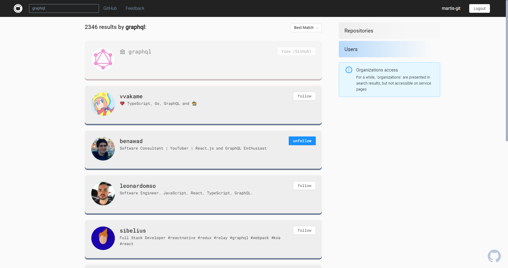

# [github-client](https://github-client.gq/)

> ⚡️ Powered by [Feature Sliced methodology](https://github.com/feature-sliced/documentation "Entire app was designed and builded with FeatureSliced core conceptions")

GitHub client within the *React Akvelon 2020* course.

[wiki]: https://github.com/martis-git/github-client/wiki
[requirements]: https://github.com/ani-team/github-client/wiki/%5BRU%5D-Requirements
[codestyle]: https://github.com/ani-team/github-client/wiki/CodeStyle
[structure]: https://github.com/ani-team/github-client/wiki/Project-Structure
[dev-guide]: https://github.com/ani-team/github-client/wiki/Dev-Guide

- [Project WIKI][wiki]
   - [Requirements (RU)][requirements]
   - [Design](https://www.figma.com/file/HxOqIdmTNtLcFLcQZzAYJC/github-client "Super design from @AdeliyaG")
   - [Dev Guide][dev-guide]
   - [Structure][structure]
   - [CodeStyle][codestyle]
- [Contributing guide](CONTRIBUTING.md)

## Overview
<!-- Указаны ссылки на "prod"-стенд как на основной и более стабильный -->

- See repo/collabs list and details of [any user](https://github-client.gq/gaearon)
- See base info and stats of [any public repository](https://github-client.gq/facebook/react) with [branches base manipulating](https://github-client.gq/facebook/react/tree/17.0.0-dev)
- Use search by [repositories](https://github-client.gq/search?o=desc&q=react&s=stars)/[users](https://github-client.gq/search?o=desc&q=google&s=repositories&type=users) with sorting
- Try our <b title="Our routing is identical with github">end-to-end routing with Github</b> with origin button, and specific adaptations on every page!
- Connect with your account safely - [by Github OAuth](https://github-client.gq/auth)
- [Get feedback](https://github-client.gq/some-unexisting-route-but-we-have-error-parking-page) if some errors occurred
- Try our base interactivity on [UserPage](https://github-client.gq/gaearon) - following, starring
- Get the best UX with our **loading && placeholder view logic**
- Try  [**github-client right now**](https://github-client.gq) or [last dev version (but unstable)](https://dev.github-client.gq) =}

> If you found issues or have ideas for service - please, [share with us](https://github.com/ani-team/github-client/issues/new) 🔥

## Technology stack
- **UI**: `react`, `antd`, `classnames`, `tailwindcss`
- **Lang**: `typescript (3.7+)`
- **Fetching**: `graphql`, `apollo-client (3+)`
   - **API Codegen**: `graphql-codegen`
- **Routing**: `react-router`
- **Tests**: `eslint`, `prettier`, `graphql-eslint`, `stylelint`
- **Auth**: `GitHub OAuth`, `firebase`
- **CI/CD**: `github-actions`, `firebase`

